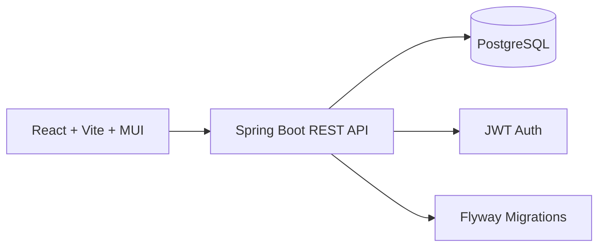

# Playstore Pulse (Mini Google Play Clone)

Portfolio-ready full‑stack project: a curated “mini Play Store” with browsing, search, install counts, reviews, and JWT‑based auth.

## Highlights
- Browse and search apps with category filtering, pagination, and sorting.
- App detail pages with screenshots, ratings, installs, permissions (mock), and reviews.
- Authenticated actions (install + review) secured via JWT.
- Spring Boot + JPA backend with Flyway migrations.
- React + Vite + MUI frontend with a custom theme and responsive layout.

## Tech Stack
- Frontend: React, TypeScript, Vite, Material UI
- Backend: Spring Boot 3, Spring Security, JPA, JWT
- Database: PostgreSQL
- Migration: Flyway

## Quick Start
### 1) Start PostgreSQL
```bash
cd backend
docker-compose up -d
```

### 2) Run the API
```bash
cd backend/api
mvn spring-boot:run
```

### 3) Run the frontend
```bash
cd frontend
npm install
npm run dev
```

Open `http://localhost:5173`.

### Demo credentials
- Email: `demo@local.test`
- Password: `password`

## Environment Variables
Frontend:
```
VITE_API_BASE_URL=http://localhost:8080
```

Backend:
```
SPRING_DATASOURCE_URL=jdbc:postgresql://localhost:5432/playstore
SPRING_DATASOURCE_USERNAME=postgres
SPRING_DATASOURCE_PASSWORD=postgres
APP_CORS_ALLOWED_ORIGINS=http://localhost:5173
APP_SECURITY_JWT_SECRET=replace-with-a-long-random-secret
APP_SECURITY_JWT_EXPIRATION_SECONDS=3600
```

## API Overview
- `GET /api/apps` — list, search, filter, sort
- `GET /api/apps/{id}` — app details
- `POST /api/apps/{id}/install` — increment installs (auth)
- `GET /api/apps/{id}/reviews` — list reviews
- `POST /api/apps/{id}/reviews` — create/update review (auth)
- `GET /api/categories` — list categories
- `POST /api/auth/login` — login
- `POST /api/auth/register` — register
- `GET /api/auth/me` — current user

## Architecture

## Screenshots
